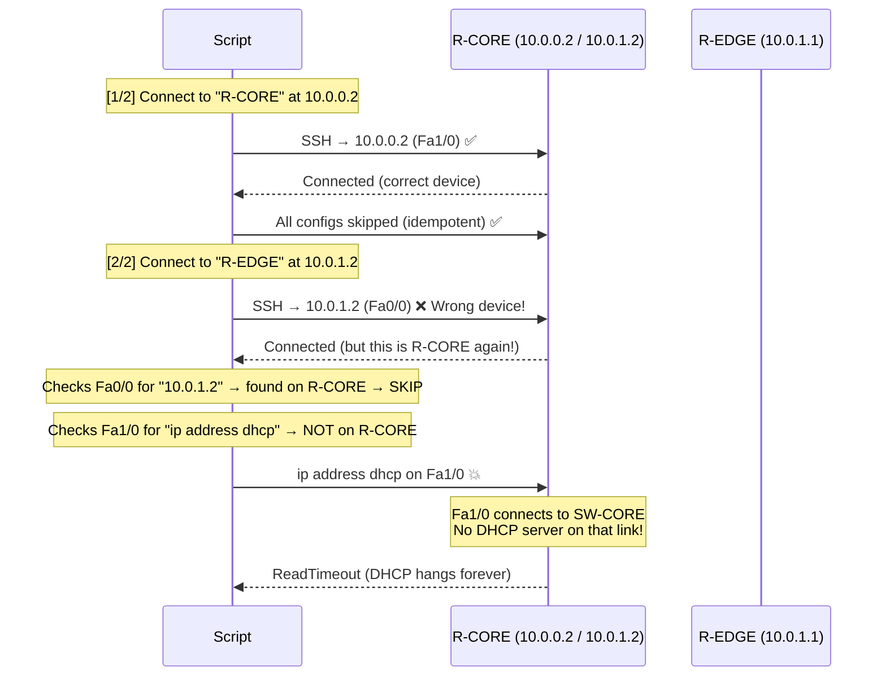

# 🔍 Root Cause Analysis: R-EDGE DHCP Timeout & Configuration Issues

## The Real Problem: Inventory IPs Are SWAPPED

The DHCP timeout is a **red herring**. The script was never actually connecting to R-EDGE at all — it was connecting to **R-CORE twice**.

### Evidence from the Topology

From [topology.png](file:///home/security_analysis/network/github-repo/Data-Networks-Project/topology.png):

```
NAT1 ──nat0── R-EDGE(f1/0) ──(f0/0)──(f0/0)── R-CORE(f1/0) ──── SW-CORE
```

- **R-EDGE f0/0** connects to **R-CORE f0/0** (the `10.0.1.0/30` transit link)
- **R-CORE f1/0** connects to **SW-CORE** (the `10.0.0.0/30` link)

### Evidence from Router Consoles

| Device | Interface | **Actual IP** | **Inventory Says** | **Match?** |
|--------|-----------|--------------|-------------------|:----------:|
| R-CORE | Fa0/0 | **10.0.1.2** | 10.0.1.1 | ❌ SWAPPED |
| R-CORE | Fa1/0 | 10.0.0.2 | 10.0.0.2 | ✅ |
| R-EDGE | Fa0/0 | **10.0.1.1** | 10.0.1.2 | ❌ SWAPPED |
| R-EDGE | Fa1/0 | 192.168.42.239 (DHCP) | dhcp | ✅ |

> [!CAUTION]
> The `host` field for R-EDGE in `inventory.yaml` is `10.0.1.2`, but that IP belongs to **R-CORE's Fa0/0**!

### What Actually Happened During Every Script Run



### Static Route Next-Hops Are Also Swapped

| Route | Inventory `next_hop` | **Should Be** |
|-------|---------------------|--------------|
| R-CORE → `0.0.0.0/0` | `10.0.1.2` (R-EDGE) | `10.0.1.1` (R-EDGE Fa0/0) |
| R-EDGE → `10.0.0.0/8` | `10.0.1.1` (R-CORE) | `10.0.1.2` (R-CORE Fa0/0) |

> [!NOTE]
> The static routes happen to already be correct on the actual routers (configured manually). The inventory just needs to match reality so future pushes don't break them.

## Fix Summary

1. **`inventory.yaml`** — Swap the Fa0/0 IP addresses and fix the `host` / `next_hop` fields
2. **`01_configure_routers.py`** — The `send_command_timing` DHCP approach is good, just needs a longer delay
