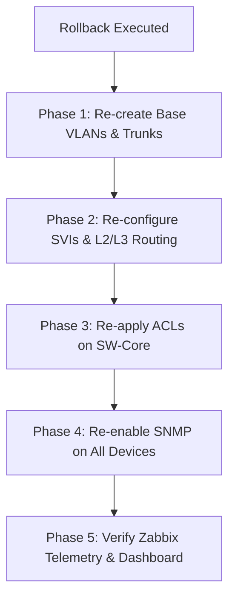

# Post-Rollback Re-Configuration Guide
## Campus Data Network — FoE-UoR Network Project

> **Document Version:** 1.0  
> **Target Environment:** GNS3 Campus Topology (R-CORE, R-EDGE, SW-Core, Distribution & Access Switches, VM-Zabbix)  
> **Author:** Network Security & Engineering Team — University of Ruhuna  

---

## 1. Executive Summary & Impact Analysis

Executing the automated rollback script (`ansible-playbook playbooks/rollback.yml`) strips all automation-applied configurations from the campus network to return devices to a clean, default state. 

### ⚠ What Rollback Removes:
1. **VLAN Database:** Deletes non-default VLANs (`VLAN 10 DEIE`, `VLAN 20 DCEE`, `VLAN 30 DMME`, `VLAN 40 DIS`, `VLAN 99 MGMT`, `VLAN 100 NATIVE`).
2. **Layer 2 Interface Settings:** Resets all trunk ports, native VLANs, allowed VLAN lists, access port assignments, and Spanning Tree (STP) customizations.
3. **Layer 3 Routing & SVIs:** Deletes department SVIs, `no ip routing` on distribution switches, removes OSPF process `router ospf 1`, and clears static return routes.
4. **Access Switch Gateways:** Removes `ip default-gateway` and static default routes from all Layer 2 switches.
5. **SNMP & Monitoring Settings:** Removes SNMP community strings (`snmp-server community`), severing Zabbix telemetry collection.

### 📉 Impact on Monitoring & Connectivity:
* **Zabbix Server (`10.10.40.100`):** Loses gateway reachability to `10.10.40.1` and all switch/router targets.
* **Zabbix Web UI:** All host indicators turn 🔴 **Red (SNMP / ICMP Unavailable)**.
* **Campus Connectivity:** Inter-VLAN routing is disabled; department hosts are isolated.

---

## 2. Post-Rollback Recovery Roadmap

To restore full network functionality and bring the **Zabbix Monitoring System** back online after a rollback, follow the manual CLI restoration steps below or run the automated re-deployment suite.



---

## 3. Detailed Manual Re-Configuration Steps

### Phase 1: Re-create Base VLANs & Trunk Links

On **SW-Core**, **Distribution Switches** (`SW-D-*`), and **Access Switches** (`SW-A-*`):

```cisco
configure terminal

! 1. Create Campus VLANs
vlan 10
 name VLAN_DEIE
vlan 20
 name VLAN_DCEE
vlan 30
 name VLAN_DMME
vlan 40
 name VLAN_DIS
vlan 99
 name MGMT
vlan 100
 name NATIVE
exit

! 2. Re-configure Trunk Port to SW-Core / Neighbors (e.g. Gi1/0)
interface GigabitEthernet1/0
 switchport trunk encapsulation dot1q
 switchport mode trunk
 switchport trunk native vlan 100
 switchport trunk allowed vlan 10,20,30,40,99,100
 no shutdown
exit
```

---

### Phase 2: Re-configure Layer 3 SVIs & Routing

#### 2.1 On `SW-Core` (Core L3 Switch):
```cisco
configure terminal
ip routing

! Management SVI
interface Vlan99
 ip address 10.99.99.1 255.255.255.0
 no shutdown
exit

! DIS Monitoring SVI (Zabbix Subnet)
interface Vlan40
 ip address 10.10.40.1 255.255.255.0
 no shutdown
exit

! OSPF Routing Process
router ospf 1
 router-id 10.99.99.1
 network 10.99.99.0 0.0.0.255 area 0
 network 10.10.40.0 0.0.0.255 area 0
exit
end
write memory
```

#### 2.2 On Layer 2 Access Switches (`SW-A-DIS`, `SW-A-DEIE`, etc.):
```cisco
configure terminal

! Management SVI
interface Vlan99
 ip address 10.99.99.24 255.255.255.0  ! Replace with device Management IP
 no shutdown
exit

! Default Gateway (L2 mode) & Static Route (Cisco IOS GNS3 requirement)
ip default-gateway 10.99.99.1
ip route 0.0.0.0 0.0.0.0 10.99.99.1
end
write memory
```

---

### Phase 3: Re-apply ACLs on `SW-Core` for Zabbix Traffic

To ensure `VM-Zabbix` (`10.10.40.100`) can poll management devices and receive return traffic across VLANs:

```cisco
configure terminal

! Permit Zabbix outbound SNMP & ICMP to Management VLAN
ip access-list extended ACL_DIS_IN
 40 permit udp host 10.10.40.100 10.99.99.0 0.0.0.255 eq snmp
 62 permit icmp host 10.10.40.100 10.99.99.0 0.0.0.255
 85 permit ip host 10.10.40.100 any
exit

! CRITICAL: Permit return traffic from Management VLAN back to Zabbix
ip access-list extended ACL_MGMT_IN
 15 permit ip 10.99.99.0 0.0.0.255 host 10.10.40.100
exit

! Apply ACLs to SVIs
interface Vlan40
 ip access-group ACL_DIS_IN in
exit
interface Vlan99
 ip access-group ACL_MGMT_IN in
exit

end
write memory
```

---

### Phase 4: Re-enable SNMP Monitoring on All Devices

SNMP must be re-enabled on **all 10 devices** (`R-CORE`, `R-EDGE`, `SW-Core`, all Distribution and Access Switches):

```cisco
configure terminal
snmp-server community public RO
end
write memory
```

---

### Phase 5: Re-verify Zabbix Web UI & Tunneling

1. **Verify Connectivity from `VM-Zabbix` Container:**
   ```bash
   # Ping gateway
   ping -c 2 10.10.40.1

   # Ping SW-Core Management SVI
   ping -c 2 10.99.99.1

   # Ping Access Switch
   ping -c 2 10.99.99.24

   # Test SNMP walk
   snmpwalk -v2c -c public 10.99.99.1 sysDescr.0
   ```

2. **Ensure GNS3 VM Port-Forwarding (`socat`) is Active:**
   If host browser access to `http://192.168.255.128:9090/zabbix` is interrupted, re-run on **`gns3@gns3vm`**:
   ```bash
   ZABBIX_PID=$(docker inspect -f '{{.State.Pid}}' $(docker ps -q --filter name=Zabbix))
   sudo socat TCP-LISTEN:9090,fork,reuseaddr EXEC:"sudo nsenter -t $ZABBIX_PID -n nc 127.0.0.1 80" &
   ```

3. **Check Zabbix Web Dashboard:**
   * Go to **Monitoring → Hosts**.
   * Verify all devices (`R-CORE`, `R-EDGE`, `SW-Core`, `SW-A-DIS`) display 🟢 **Green (SNMP)**.

---

## 4. Automated Re-Deployment Alternative (Fastest)

Rather than executing manual CLI commands on every device, execute the full automation pipeline from your management machine:

```bash
cd /home/security_analysis/network/github-repo/Data-Networks-Project/automation

# 1. Re-configure Core & Edge Routers via Netmiko
python3 netmiko-automation/01_configure_routers.py

# 2. Re-apply Switch VLANs, Trunks, SVIs, and OSPF via Ansible
cd ansible-project
ansible-playbook playbooks/site.yml

# 3. Re-configure SNMP across all 10 devices
cd ../netmiko-automation
python3 02_configure_snmp_all.py

# 4. Verify full configuration
python3 03_verify_config.py
```

---

## 5. Verification Checklist

| Verification Task | Command / Location | Expected Result | Status |
| :--- | :--- | :--- | :---: |
| **VLAN Existence** | `SW-Core# show vlan brief` | VLANs 10, 20, 30, 40, 99, 100 Active | ☐ |
| **Trunk Status** | `SW-A-DIS# show interfaces trunk` | Trunking dot1q, VLAN 99 allowed | ☐ |
| **L2 Default Route** | `SW-A-DIS# show ip route` | `0.0.0.0/0 via 10.99.99.1` | ☐ |
| **Zabbix Ping** | `VM-Zabbix$ ping 10.99.99.24` | `0% packet loss` | ☐ |
| **SNMP Response** | `VM-Zabbix$ snmpwalk -v2c -c public 10.99.99.1` | Cisco IOS System Description returned | ☐ |
| **Zabbix UI Status** | `http://192.168.255.128:9090/zabbix` | Hosts display 🟢 **Green (SNMP)** | ☐ |
