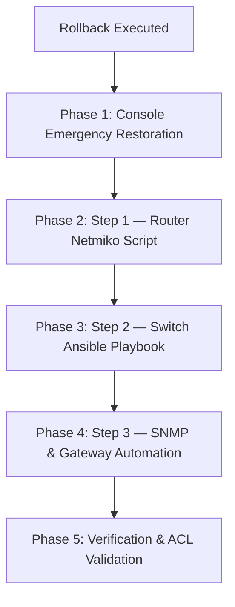

# Post-Rollback Re-Configuration & Recovery Guide
## Campus Data Network — FoE-UoR Network Project

> **Document Version:** 2.0  
> **Target Environment:** GNS3 Campus Topology (R-CORE, R-EDGE, SW-Core, Distribution Switches, Access Switches, Ubuntu Docker / VM-Zabbix)  
> **Author:** Network Security & Engineering Team — University of Ruhuna  

---

## 1. Executive Summary & Impact Analysis

Executing the automated rollback script (`ansible-playbook playbooks/rollback.yml`) strips all automation-applied configurations from the campus network to return devices to a clean, default state. 

### ⚠ What Rollback Removes:
1. **VLAN Database:** Deletes non-default VLANs (`VLAN 10 DEIE`, `VLAN 20 DCEE`, `VLAN 30 DMME`, `VLAN 40 DIS`, `VLAN 99 MGMT`, `VLAN 100 NATIVE`) and leaves newly created VLANs in `act/lshut` (Active / Locally Shutdown) state.
2. **Layer 2 Interface Settings:** Resets all trunk ports, native VLANs, allowed VLAN lists, access port assignments, and Spanning Tree (STP) customizations.
3. **Layer 3 Routing & Uplinks:** Deletes department SVIs, disables IP routing (`no ip routing`), reverts routed uplinks (`Gi0/0`, `Gi0/2`, `Gi0/3`) back to Layer 2 switchports, removes `router ospf 1`, and clears static return routes.
4. **Access Switch Management & Keys:** Removes `ip default-gateway` from Layer 2 switches and clears SSH RSA Encryption Keys.
5. **SNMP & Monitoring Settings:** Removes SNMP community strings (`snmp-server community`), severing Zabbix telemetry collection.

### 📉 Impact on Management & Connectivity:
* **The "Sawing Off the Branch" Effect:** Because Ansible communicates via SSH over Management VLAN 99, disabling `ip routing` or converting routed uplinks to L2 switchports breaks SSH mid-playbook, triggering 60-second Ansible timeouts.
* **No Route to Host Errors:** SSH fails with `connect to host 10.99.99.x port 22: No route to host` because SW-CORE's ARP requests are dropped by switches missing active VLAN 99 or having `act/lshut` VLAN status.
* **Zabbix Telemetry:** All host indicators in Zabbix (`http://10.10.40.100/zabbix`) turn 🔴 **Red (SNMP / ICMP Unavailable)**.

---

## 2. Post-Rollback Step-by-Step Recovery Roadmap

To restore full network functionality, SSH management, and **Zabbix Monitoring** after a rollback, follow the structured recovery pipeline:



---

## 3. Phase 1: Manual Console Emergency Restoration

Before running automation scripts, SSH connectivity must be restored by pasting emergency console fixes into devices that lost management reachability.

### 1.1 Restore Distribution Switches (`SW-D-DEIE`, `SW-D-DCEE`, `SW-D-DMME`)

Convert uplinks back to Layer 3 routed interfaces and restore OSPF routing:

#### On `SW-D-DEIE` Console:
```cisco
enable
configure terminal
interface GigabitEthernet0/0
 no switchport
 ip address 10.0.10.2 255.255.255.252
 no shutdown
exit
router ospf 1
 router-id 3.3.3.11
 network 10.0.10.0 0.0.0.3 area 0
 network 10.10.10.0 0.0.0.255 area 0
 network 10.99.99.0 0.0.0.255 area 0
exit
ip route 10.99.99.100 255.255.255.255 10.0.10.1
end
write memory
```

#### On `SW-D-DCEE` Console:
```cisco
enable
configure terminal
interface GigabitEthernet0/2
 no switchport
 ip address 10.0.20.2 255.255.255.252
 no shutdown
exit
router ospf 1
 router-id 3.3.3.12
 network 10.0.20.0 0.0.0.3 area 0
 network 10.10.20.0 0.0.0.255 area 0
 network 10.99.99.0 0.0.0.255 area 0
exit
ip route 10.99.99.100 255.255.255.255 10.0.20.1
end
write memory
```

#### On `SW-D-DMME` Console:
```cisco
enable
configure terminal
interface GigabitEthernet0/3
 no switchport
 ip address 10.0.30.2 255.255.255.252
 no shutdown
exit
router ospf 1
 router-id 3.3.3.13
 network 10.0.30.0 0.0.0.3 area 0
 network 10.10.30.0 0.0.0.255 area 0
 network 10.99.99.0 0.0.0.255 area 0
exit
ip route 10.99.99.100 255.255.255.255 10.0.30.1
end
write memory
```

---

### 1.2 Restore Access Switches (`SW-A-DIS`, `SW-A-DEIE`, `SW-A-DCEE`, `SW-A-DMME`)

Fix `act/lshut` VLAN status, generate RSA SSH key, and set default gateways:

#### On `SW-A-DIS` Console (and other access switches if unreachable):
```cisco
enable
configure terminal

! 1. Fix Trunk Uplink to SW-CORE
interface GigabitEthernet1/0
 switchport trunk encapsulation dot1q
 switchport mode trunk
 switchport trunk native vlan 100
 switchport trunk allowed vlan 10,20,30,40,99,100
 no shutdown
exit

! 2. Re-create VLANs and remove 'act/lshut' (Locally Shutdown) block
vlan 99
 name MGMT
 state active
 no shutdown
exit
vlan 10
 name VLAN_DEIE
 state active
 no shutdown
exit
vlan 20
 name VLAN_DCEE
 state active
 no shutdown
exit
vlan 30
 name VLAN_DMME
 state active
 no shutdown
exit
vlan 40
 name VLAN_DIS
 state active
 no shutdown
exit
vlan 100
 name NATIVE
 state active
 no shutdown
exit

! 3. Restore Management SVI & Default Gateway
interface Vlan99
 ip address 10.99.99.24 255.255.255.0  ! Replace with device IP
 no shutdown
exit
ip default-gateway 10.99.99.1

! 4. Generate SSH RSA Keys & Enable SSH
ip domain-name campus.uor.lk
crypto key generate rsa modulus 2048
username admin privilege 15 secret admin123
line vty 0 4
 transport input ssh
 login local
exit

end
write memory
```

---

## 4. Phase 2: Automated Re-Deployment Suite (Exact Order)

Once SSH is functional across all management IPs (`10.99.99.x`), execute the 3-step automation sequence:

### Step 1: Configure Core & Edge Routers
```bash
cd /home/security_analysis/network/github-repo/Data-Networks-Project/automation/netmiko-automation
python3 01_configure_routers.py
```
* **Function:** Pushes WAN/LAN interface IP addresses, sub-interfaces, static routes, NAT, and core OSPF routing to `R-CORE` and `R-EDGE`.

### Step 2: Deploy Full Switch Infrastructure via Ansible
```bash
cd ../ansible-project
ansible-playbook site.yml
```
* **Function:** Executes 7 structured plays across all switches:
  1. Creates VLANs (10, 20, 30, 40, 99, 100).
  2. Configures trunk links with 802.1Q encapsulation and allowed VLANs.
  3. Assigns access ports to department VLANs with PortFast enabled.
  4. Configures Spanning Tree (Rapid PVST+) and priorities (24576 for distribution, 32768 for access).
  5. Enables Layer 3 distribution routing (`ip routing`, SVIs, OSPF process 1).
  6. Configures Layer 2 default gateways.
  7. Saves configuration to startup-config (`write memory`).

### Step 3: Enable SNMP Telemetry & Zabbix L2 Gateway Return Routes
```bash
cd ../netmiko-automation
python3 02_configure_snmp_all.py
```
* **Function:** Applies SNMPv2c read-only community `public`, trap host destination (`10.10.40.100`), and pushes static return routes on L2 switches for full Zabbix telemetry collection.

---

## 5. Phase 3: Verification & Security Policy Validation

### 5.1 Verification Checklist

| Verification Task | Command / Location | Expected Result | Status |
| :--- | :--- | :--- | :---: |
| **Switch SSH Access** | `ssh admin@10.99.99.11` | Successful login with password `admin123` | ✅ |
| **VLAN Database** | `SW-A-DIS# show vlan brief` | VLANs 10, 20, 30, 40, 99, 100 **active** (not `act/lshut`) | ✅ |
| **Ansible Playbook Recap** | `ansible-playbook site.yml` | `failed=0` across all 7 switches | ✅ |
| **Inter-Department ACL Enforcement** | `PC1> ping 10.10.30.10` | `*10.10.10.1 ... Communication administratively prohibited` | ✅ |
| **Inter-Department Allowed Traffic** | `PC1> ping 10.10.40.10` | `100% success` | ✅ |
| **Zabbix Web UI Dashboard** | `http://10.10.40.100/zabbix` | All 10 hosts display 🟢 **Green (SNMP Available)** | ✅ |

### 5.2 Explaining ICMP "Communication Administratively Prohibited"

During verification from `PC1` (VLAN 10 DEIE):
* `PC1 > ping 10.10.30.10` returns `*10.10.10.1 icmp_seq=1 ... (ICMP type:3, code:13, Communication administratively prohibited)`
* **Significance:** ICMP Type 3 Code 13 is **definitive proof** that Inter-VLAN routing is active and `SW-D-DEIE` is enforcing extended ACL (`ACL_DEIE_IN`), blocking unauthorized communication to DMME (`10.10.30.0/24`) while allowing DIS server access (`10.10.40.0/24`).
